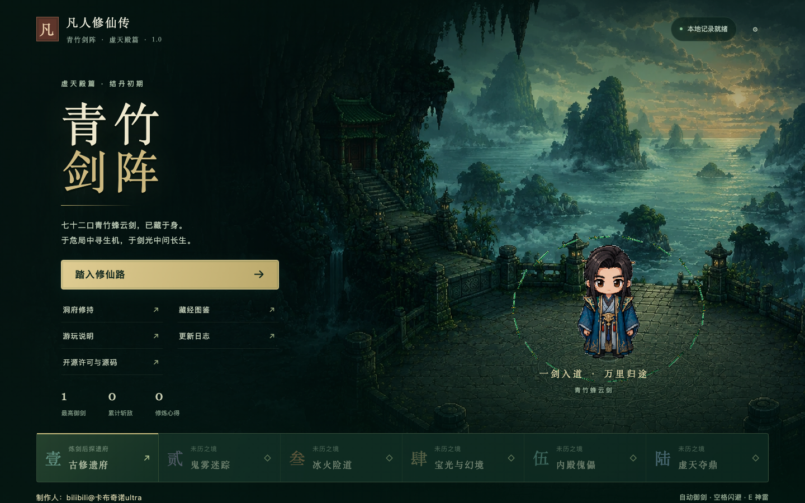
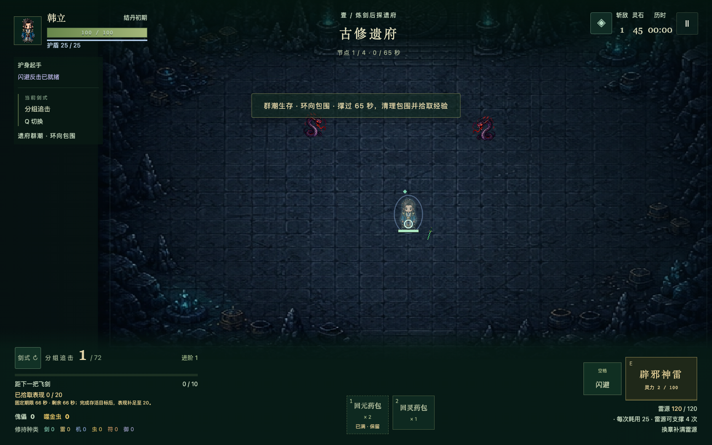

# 青竹剑阵 · 虚天殿篇

**1.0 正式发布** · 离线像素御剑同人游戏 · 原创代码 GPL-3.0-only

制作人：bilibili@卡布奇诺ultra

操控韩立走位避险，让青竹蜂云剑自动出击。选择御剑、雷法、傀儡、御虫、符阵或护身起手，通过悟道、核心与途中整备完成六章历练。





## 下载与游玩

**[下载单文件游戏](https://github.com/jindx1020-crypto/qingzhu-sword-array/releases/download/v1.0/qingzhu-1.0.html)** · **[下载免安装完整包](https://github.com/jindx1020-crypto/qingzhu-sword-array/releases/download/v1.0/qingzhu-1.0-player.zip)** · [全部附件与源码](https://github.com/jindx1020-crypto/qingzhu-sword-array/releases/tag/v1.0)

| 下载文件 | 用途 |
|---|---|
| `qingzhu-1.0.html` | 推荐，下载后用浏览器打开即可离线游玩 |
| `qingzhu-1.0-player.zip` | 解压后双击「开始游戏.html」，附兼容版、简短说明和对应源码 |
| `qingzhu-1.0-png.html` | 图片解码有问题时使用，玩法与存档格式相同 |
| `qingzhu-1.0-source.zip` | 对应的可修改源码、素材、开发说明和构建脚本 |
| `SHA256SUMS.txt` | GitHub 下载附件的 SHA-256 校验清单 |

GitHub 附件使用英文文件名，游戏界面与说明为中文；本地构建仍保留原中文文件名。游玩无需安装 Node.js 或开发环境。源码 checkout 不包含重复的 HTML／ZIP，需要修改或自行构建时再准备下列开发环境。

移动 WASD／方向键，空格闪避，E 神雷，Q 切剑式，1／2 使用物资。触屏使用摇杆和技能按钮，点战场瞄准，点解除恢复分守。首次建议选「初入仙途」并进行分步练习。

**升级、移动文件或更换浏览器前，请在设置中导出存档。** 存档在浏览器本地，不自动同步。完整操作、玩法与恢复流程见 [游玩说明](青竹剑阵_游玩说明.md)。

## 内容

- 六章、22 节点，含妖蛇、鬼王、虫潮、取宝、幻境、狼首傀儡、冰焰退避和玄骨终局。
- 六种起手、72 项战术强化、12 项联动和12 件战术核心。
- 自动飞剑与友方协战、触屏控制、独立神雷资源、洞府修持和药园补给。
- 主篇、定种、章回重温、无尽、自由试招、分步练习及独立对照体验。
- 本地成绩、章末分段与可导出恢复资料；旧局继续使用各自规则。

## 开发与构建

需要 Node.js **22.13+** 与 npm。源码和离线成品不需要作者的 Codex 环境、GitHub 登录或云端凭据。

```sh
cd game
npm ci
npm run dev
```

开发地址以终端输出为准。生成发布文件：

```sh
npm run check
npm run build
npm run build:release
npx playwright install chromium
npm run test:browser
npm run check:release
```

发布附件统一生成在 `release/1.0/`，包含可直接分发的免安装玩家包；根目录保留两个 HTML 作为原路径游玩入口。首次安装依赖和浏览器需要网络；生成后的游戏可离线运行。Linux 安装浏览器可能需要 `npx playwright install --with-deps chromium`。

## 本地目录导航

| 要做的事 | 位置 |
|---|---|
| 直接玩游戏 | 根目录两份 HTML，保留原来的游玩路径 |
| 发给玩家／上传 GitHub Release | `release/1.0/`：游戏、源码包、免安装包和校验清单 |
| 录制介绍视频 | `release/video/`：介绍 HTML、口播稿和录制说明 |
| 修改游戏 | `game/`：源码、素材、脚本和测试 |
| 查说明与验收 | 根游玩说明、更新日志及 `docs/` |
| 查历史资料 | `local-archive/`：旧源码、测试原文、方案、参考图和旧交付 |

详细结构与整理记录见 [目录说明](docs/directory-layout.md)。`release/` 和 `local-archive/` 是本地产物／资料，不提交 Git。源码 checkout 的发布文件由构建生成。

## 文档

- [视频口播介绍页与录制方法](docs/presentation/README.md)

- [玩法说明](青竹剑阵_游玩说明.md) · [更新日志](青竹剑阵_更新日志.md)
- [开发与构建](docs/development.md) · [维护约定](AGENTS.md) · [兼容规则沿革](docs/compatibility.md)
- [1.0 验收报告](docs/release-1.0.md) · [GitHub 发布步骤](docs/publishing.md)
- [原著与改编边界](docs/adaptation.md) · [素材来源](docs/assets.md)
- [贡献说明](CONTRIBUTING.md) · [第三方声明](THIRD_PARTY_NOTICES.md)

自动构建和验证结果见 [GitHub Actions](https://github.com/jindx1020-crypto/qingzhu-sword-array/actions/workflows/ci.yml)。

## 开源与素材

原创程序代码采用 **[GNU GPL v3 only](LICENSE)**。允许在许可条件下修改、分发和商用；分发修改版需遵守相应源码和许可要求。第三方代码保留原许可，代码许可不授予小说、人物设定或图片的权利。[授权范围与源码说明](docs/licensing.md)

本作是《凡人修仙传》的非官方同人改编，不宣称权利人授权。图片为本项目 AI 生成或参考生成素材，单列来源；两张原始参考图的外部来源与再授权情况仍待作者确认。公开素材不能视为取得全部第三方权利。

## 验证范围

技术验收包含规则测试、存档故障回归、真实引擎固定策略样本、隔离浏览器操作和多尺寸截图。自动策略不代表真人胜率，触屏模拟不代表实机手感；手机实机、单手体验和部分原著措辞仍待作者验证。具体证据和边界见验收报告。
